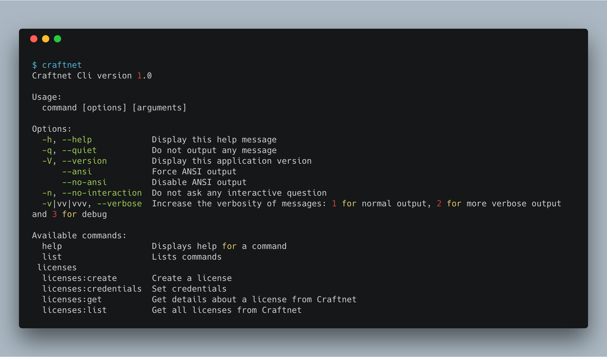

# Craftnet CLI

A CLI for the [Craftnet API](https://docs.api.craftcms.com/).

## Installation

To install the cli, run `composer global require superbig/craftnet-cli`

Make sure `~/.composer/vendor/bin/` is added to your PATH.

## Usage

|Command|Description|
|---|---|
|`craftnet`|List all the commands|
|`craftnet licenses:credentials`|Set credentials|
|`craftnet licenses:list`|List all licenses|
|`craftnet licenses:get`|Get details about a license from Craftnet|
|`craftnet licenses:create`|Create a license|

Brought to you by [Superbig](https://superbig.co)
